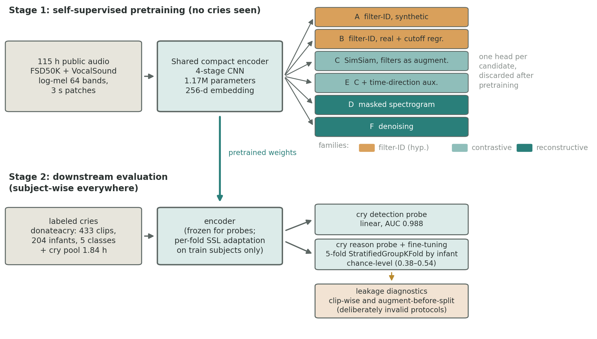
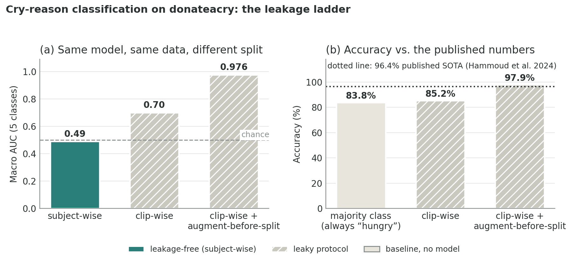

# Self-Supervised Pretext Tasks for Infant Cry Analysis

Paper: [arXiv:2608.30456](https://arxiv.org/abs/2608.30456)

A single-GPU study of self-supervised learning (SSL) for infant cry
acoustics, built only on public data whose licenses I verified clip by clip.
It reproduces the central conclusions of Gorin et al. (Ubenwa Health, ICASSP
2023) with an encoder about 70 times smaller, and adds a result I could not
find anywhere in the literature: under subject-wise evaluation, donateacry,
the de facto public benchmark for cry reasons, does not support reason
classification at all. The 90%+ accuracies reported on it come from
clip-level splits. This repository reproduces that leakage and measures it.

Code and comments are in Italian. This README is the English entry point.

## Findings

1. Reconstructive pretext tasks win for cry detection. In a six-task
   bake-off (same 1.17M-parameter encoder, same step budget, same
   evaluation), masked-spectrogram modeling reaches 0.988 AUC on cry/non-cry
   with a linear probe and subject-wise splits, despite never hearing a
   single cry during pretraining. Full ranking: masked-spec 0.988, denoising
   0.982, SimSiam 0.972, SimSiam with a temporal auxiliary 0.967, filter-ID
   on real audio 0.880, filter-ID on synthetic signals 0.793.

2. Cry reason is not recoverable from donateacry when splits respect
   subject identity. Every encoder sits at chance (AUC 0.38 to 0.54 over 5
   classes), including a frozen HuBERT-base with 94M parameters that I ran
   as a capacity control. Adapting on 1.8 hours of real cries changes
   nothing. End-to-end fine-tuning stops at 0.49. Whatever the labels
   contain, more capacity does not find it, which points at the labels.

3. The published 90%+ numbers are reproducible without any cry-reason
   signal. I re-ran my own fine-tuning under the literature's protocol,
   changing nothing but the split. Clip-wise splits alone: 85.2% accuracy,
   barely above the 83.8% you get by always answering "hungry". Clip-wise
   splits with augmentation applied before splitting, which is the common
   pipeline: 97.9% accuracy (0.976 AUC), matching the 96.4% state of the
   art reported on this dataset, from the same model that measures 0.49
   AUC when splits respect subject identity.

4. Augmentation cannot stand in for subjects. I expanded the labeled set
   twentyfold with vocoder and noise-mixing variants (21 hours, class
   balanced) and cross-subject AUC stayed where it was. The effective sample
   size for this task is the number of infants, not the number of clips.

## Why this study

The reference point is Gorin et al., *Self-supervised learning for infant
cry analysis* (ICASSP 2023 workshops, [arXiv:2305.01578](https://arxiv.org/abs/2305.01578)).
They reach 74.5 AUC on 3-class cry triggers with SSL pretraining plus
cry-domain adaptation, using a private clinical corpus (about 1,150
recordings from about 900 newborns, labels assigned by staff) and an
80M-parameter CNN14. I wanted to know two things. Do their conclusions hold
with a compact encoder and public data only? And which pretext task earns
its keep at this scale? Their paper commits to SimCLR without comparing
alternatives, so here six candidates compete under a fixed budget. Two of
them test a hypothesis of mine about teaching frequency-band structure
explicitly, and the bake-off was designed so that its predicted failure
modes would be measured instead of argued.

## Data

All licenses verified per clip; anything unverifiable is dropped and
counted, in code, by scripts `01` and `02`. Every admitted clip lands in
`data/licenses_manifest.csv` with source, author, license and link.

| Corpus | Clips kept | Hours | License filter |
|---|---|---|---|
| FSD50K | 43,379 | 90.1 | CC0 + CC BY (7,818 CC-BY-NC excluded) |
| VocalSound | 20,985 | 24.4 | CC BY-SA 4.0 |
| donateacry (cleaned) | 447 → 433 | 0.9 | ODbL/DbCL; 14 spurious clips removed by ear |
| Freesound direct queries | 204 | 2.1 | CC0 + CC BY, deduplicated against FSD50K |
| Synthetic variants | 10,932 | 21.0 | derived from donateacry (see Augmentation) |

Audio is cached as memory-mapped float16 log-mel (64 bands, 16 kHz, 25 ms
window, 10 ms hop) by script `03`.

Labels got a human pass. A PANNs Cnn14 tagger (CC BY 4.0 checkpoint)
triages the pool; I then listened to 127 borderline cases, selected by
stratified value of information (conflicts with FSD50K ground truth, a gray
zone for threshold calibration, contamination sentinels), through a small
Streamlit tool, with a second pass separating infant cries from adult cries
and animal sounds. About half of the FSD50K clips tagged "Baby cry" that
survived triage turned out to be adults crying; they became hard negatives.
Of the 15 lowest-scoring donateacry "cries", 11 were not cries at all.

## Method



The encoder is a 4-stage CNN (two 3x3 convolutions per stage, BatchNorm,
stride 2), global average pooling, 256-d embedding: 1.17M parameters, sized
for edge deployment on purpose. Every candidate uses this same encoder and
differs only in the head, which is discarded after pretraining.

The six pretext tasks (script `08`, `src/babycry/pretext.py`):

| | Task | Hypothesis under test |
|---|---|---|
| A | Filter-ID on synthetic harmonic signals | Can band-filter classification on synthetic stationary signals teach frequency awareness? Predicted weaknesses: shortcut learning on band energies, no natural statistics. |
| B | Filter-ID on real audio + continuous cutoff regression | Same idea with real-audio statistics and a harder regression target. |
| C | SimSiam, with band filters as augmentation plus noise mixing, masking, pitch/time shifts | The counter-hypothesis: filters belong in the augmentation, not in the label. |
| D | Masked spectrogram modeling (trained from scratch; no NC-licensed weights) | Reconstruction in input space. |
| E | C + auxiliary time-direction classification | Force sensitivity to temporal dynamics. |
| F | Denoising (reconstruct clean log-mel from a mix with another sample) | Noise robustness as a learned property, without a runtime denoiser. |

All three weaknesses predicted for the filter-ID line materialized in the
numbers, and the same instinct survives in candidate C, where the filters
work well as augmentation. I find that a more useful outcome than either
side of the argument winning by rhetoric.

Evaluation is where most of the cry literature goes wrong, so the protocol
is strict. Every split is by subject (donateacry contributor prefix,
Freesound uploader), never by clip, and this includes the SSL stages:
domain adaptation is re-run per fold on the training subjects only, because
contamination at the representation level is leakage just like label
leakage. Metrics are macro one-vs-rest AUC, balanced accuracy and ECE,
under StratifiedGroupKFold with 5 folds. A clip-wise split, deliberately
leaky, is computed once as a diagnostic.

For augmentation (script `04`), each donateacry clip is expanded two ways:
PSOLA vocoder variants with moderate F0 shifts (0.5 to 3 semitones) and
formant scaling from 0.88 to 1.12, which simulate different vocal-tract
sizes while keeping the temporal gesture intact; and mixes with domestic
noise drawn from the license-clean FSD50K pool at 3 to 20 dB SNR. Synthetic
variants inherit the source infant's identity for splitting purposes. They
are not new subjects, and evaluation only ever uses real audio.

## Results

Cry/non-cry linear probe (541 verified positives, 428 negatives of which 30
hard; subject-wise 5-fold):

| Pretext | AUC |
|---|---|
| D — masked spectrogram | 0.988 ± 0.004 |
| F — denoising | 0.982 ± 0.006 |
| C — SimSiam + filter augmentation | 0.972 ± 0.015 |
| E — C + temporal aux | 0.967 ± 0.020 |
| B — filter-ID (real) | 0.880 ± 0.024 |
| A — filter-ID (synthetic) | 0.793 ± 0.040 |

Cry-reason probes on donateacry (5 classes, subject-wise):

| Setting | AUC macro |
|---|---|
| Best pretext, linear probe | 0.539 ± 0.034 (E; all others 0.38–0.47) |
| After SSL adaptation on 1.84 h of cries (per-fold) | 0.33–0.45 |
| Frozen HuBERT-base (capacity control) | 0.42 |
| Same embeddings, clip-wise leaky split | 0.58–0.61 (HuBERT 0.61) |
| End-to-end fine-tuning, best of 4 augmentation arms | 0.49 ± 0.11 |
| End-to-end, clip-wise split (leaky, diagnostic) | 0.70 (85.2% accuracy) |
| End-to-end, clip-wise + augment-before-split (leaky) | 0.976 (97.9% accuracy) |
| Majority-class baseline (always "hungry") | 83.8% accuracy |
| Reference: Gorin et al., clinical labels, 3 classes | 74.5 |

The fine-tuning ablation (real-only / +noise / +vocoder / +both: 0.47 /
0.46 / 0.43 / 0.49) shows the arms statistically indistinguishable, which
is finding 4.



The figure condenses the leakage argument. Left: one model, one dataset,
three split protocols. Right: the leaky protocols land on the published
accuracy range, and the majority-class baseline shows how little that
range means. Numbers in `results/finetuning_results.csv` and
`results/finetuning_leaky.csv`; the leaky runs use `--split clip` in
script `12`.

## Against prior work

What this study confirms independently, on public data, with 1/70th of the
parameters, on a consumer laptop GPU: SSL pretraining produces strong
transferable cry representations, and the decisive ingredient for reason
classification is label quality on in-domain data rather than architecture
or compute. The clinical-label pipeline of Gorin et al. remains the only
demonstrated route to above-chance reason classification.

What is new here: the controlled six-task pretext comparison at fixed
budget, with the reconstructive family clearly ahead at this scale; the
donateacry negative result with a model-capacity control, plus the measured
gap between leaky and grouped splits that explains the inflated literature;
the per-fold adaptation protocol for leakage-free SSL evaluation; the
subject-count versus clip-count evidence from the augmentation ablation;
and an ear-verified hard-negative set, including adult cries mislabeled as
infant cries in FSD50K ground truth.

## Reproducing

Windows / PowerShell, Python 3.12, one NVIDIA GPU (developed on an RTX 4060
Laptop, 8 GB). Total compute: a few evenings.

```powershell
py -3.12 -m venv .venv
.\.venv\Scripts\Activate.ps1
pip install -r requirements.txt

python scripts/01_download_corpora.py --extract   # ~25 GB, checksums + resume
python scripts/02_filter_licenses.py              # license manifest
python scripts/03_build_mel_cache.py              # memory-mapped log-mel cache
python scripts/04_genera_sintetici.py             # synthetic variants (optional)
python scripts/05_triage_panns.py                 # PANNs triage
python scripts/06_seleziona_casi_limite.py        # borderline-case selection
# ... human labeling in the Streamlit tool:
#   streamlit run scripts/esplora_dati_app.py
python scripts/07_consolida_etichette.py          # consolidated label artifacts
python scripts/08_bakeoff_pretrain.py --candidato A..F
python scripts/09_bakeoff_probe.py                # bake-off arbitration
python scripts/10_adattamento_pianto.py --candidato D|F|E|C
python scripts/11_probe_teacher.py                # HuBERT capacity control
python scripts/12_finetuning.py --sintetici nessuno|rumore|vocoder|entrambi
```

Seeds are fixed in `configs/`; every number above is in `results/*.csv`.
Audio, caches and checkpoints are not redistributed (see licenses below).
The pipeline rebuilds everything from the original sources.

## Dataset licenses and attribution

This repository redistributes no audio. Sources, each filtered per clip:
[FSD50K](https://zenodo.org/record/4060432) (CC0/CC BY per clip; ground
truth CC BY 4.0), [VocalSound](https://github.com/YuanGongND/vocalsound)
(CC BY-SA 4.0), [donateacry-corpus](https://github.com/gveres/donateacry-corpus)
(ODbL/DbCL), [Freesound](https://freesound.org) direct queries (CC0/CC BY;
per-clip attribution in `data/licenses_manifest.csv`), and the
[PANNs](https://github.com/qiuqiangkong/audioset_tagging_cnn) Cnn14
checkpoint (CC BY 4.0) for triage only. Development-only tooling includes
praat-parselmouth (GPL-3), used to generate training data and not part of
any model.

## Limitations and next steps

The negative result on reason classification is a statement about
donateacry's labels (in-the-moment parent guesses, 84% "hungry", minority
classes of 8 to 25 clips), not about the task itself. Clinical-grade or
retrospective outcome-based labels remain the open requirement.

Mean-pooled clip embeddings discard temporal structure, and the only
pretext above chance on reason was the one with a temporal auxiliary task.
My next candidate for the bake-off harness, once better-labeled data
exists, is a latent-space predictive objective over time in the JEPA
family.

Cry detection is reported here as ranking quality. Picking an operating
point (false alarms per night at fixed recall) and running a systematic
multi-SNR evaluation are mechanical follow-ups the harness already
supports.

## Citation

```bibtex
@misc{simeone2026infantcry,
  title         = {Self-Supervised Pretext Tasks for Infant Cry Analysis:
                   A Controlled Comparison and a Cautionary Result on Donateacry},
  author        = {Luigi Simeone},
  year          = {2026},
  eprint        = {2608.30456},
  archivePrefix = {arXiv},
  primaryClass  = {cs.LG}
}
```

## References

- Simeone, *Self-Supervised Pretext Tasks for Infant Cry Analysis*, 2026 —
  [arXiv:2608.30456](https://arxiv.org/abs/2608.30456) (this work)
- Gorin et al., *Self-supervised learning for infant cry analysis*, ICASSP
  2023 SASB workshop — [arXiv:2305.01578](https://arxiv.org/abs/2305.01578)
- Fonseca et al., *FSD50K: an open dataset of human-labeled sound events* —
  [arXiv:2010.00475](https://arxiv.org/abs/2010.00475)
- Gong et al., *VocalSound: a dataset for improved human vocal sounds
  recognition* — [arXiv:2205.03433](https://arxiv.org/abs/2205.03433)
- Kong et al., *PANNs: large-scale pretrained audio neural networks* —
  [arXiv:1912.10211](https://arxiv.org/abs/1912.10211)
- Chen et al., *SimSiam: exploring simple Siamese representation learning* —
  [arXiv:2011.10566](https://arxiv.org/abs/2011.10566)
